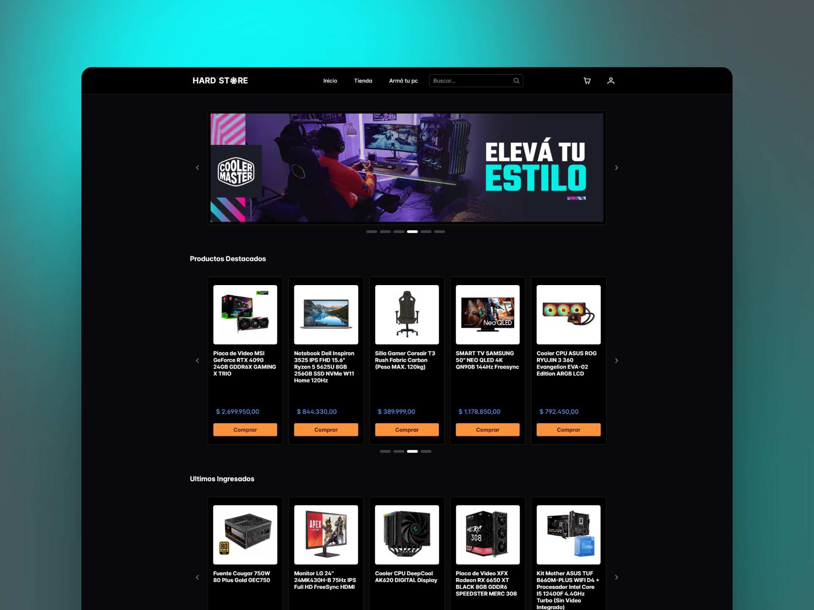
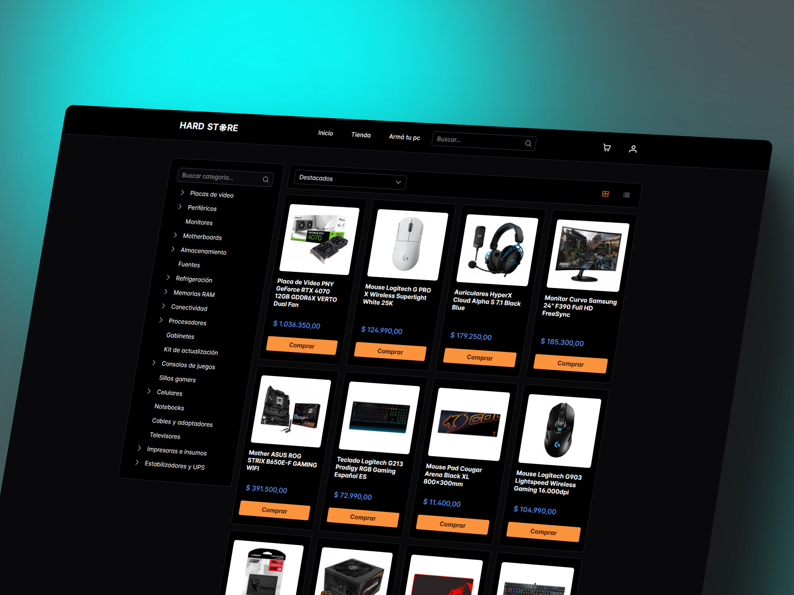
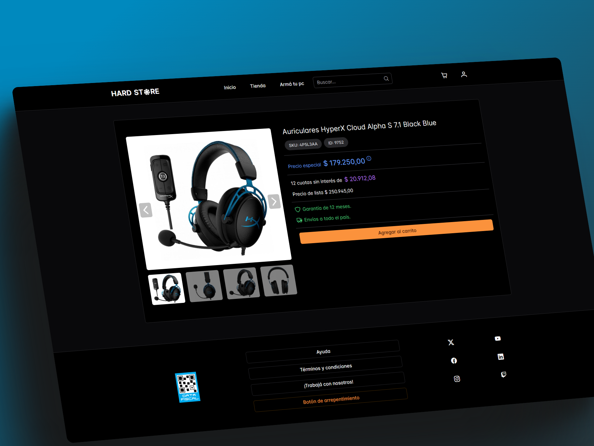
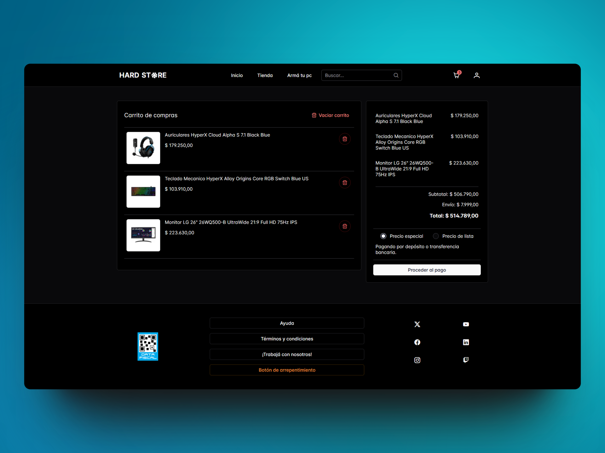

# Hard Store

 

  <a href="#Funcionalidades">Funcionalidades</a> •
  <a href="#Tecnologías-utilizadas">Tecnologías utilizadas</a> •
  <a href="#Instalación-y-uso">Instalación y uso</a> •
  <a href="#Contribuciones">Contribuciones</a>

 

Hard Store es una  tienda online especializada en hardware de PC, periféricos y todo lo relacionado. Desarrollada con Angular 17, esta aplicación utiliza Server Side Rendering para mejorar el rendimiento y SEO, gestionada con NgRx para un manejo eficiente del estado, y alojada en Firebase. La interfaz de usuario está construida con PrimeNG y PrimeFlex, proporcionando una experiencia moderna y responsiva.

 

 
 

## Funcionalidades

- **Registro e Inicio de Sesión**: Los usuarios pueden registrarse y acceder a sus cuentas.
- **Gestión de Pedidos y Compras**: Los usuarios pueden gestionar sus pedidos y el historial de compras.
- **Favoritos**: Los usuarios pueden añadir productos a su lista de favoritos.
- **Catálogo de Productos**: Visualiza el catálogo completo de productos disponibles.
- **Filtros y Ordenación**: Filtra los productos por categorías y ordénalos según diferentes criterios.
- **Barra de Búsqueda**: Busca productos rápidamente usando la barra de búsqueda.
- **Sección "Armá tu PC"**: Guía paso a paso para escoger componentes y armar una PC a medida.

 

 

 

 

## Tecnologías Usadas

- **Angular 17**: Framework principal para el desarrollo frontend.
- **Server Side Rendering**: Mejoras en rendimiento y SEO.
- **NgRx**: Gestión del estado de la aplicación.
- **Firebase**: Backend para autenticación, base de datos y hosting.
- **PrimeNG**: Componentes de UI para Angular.
- **PrimeFlex**: Utilidades CSS para diseños responsivos.
  
 
